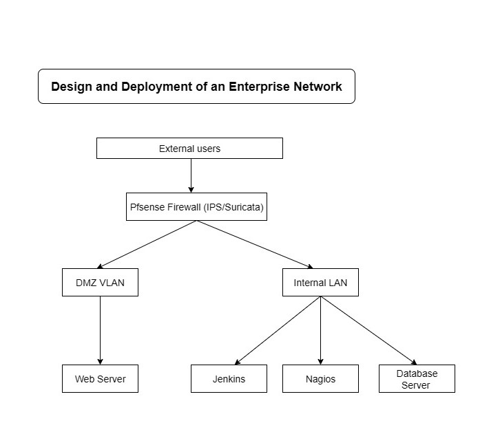
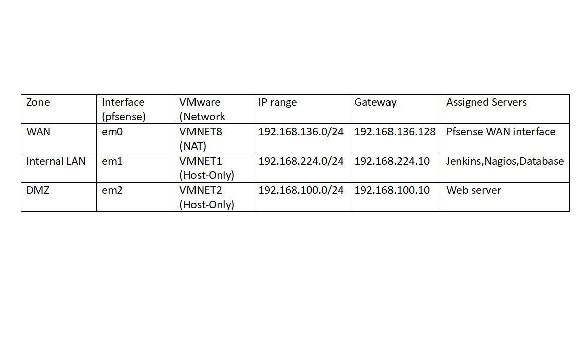

# Design and Deployment of an Enterprise Network

##  Project Overview
This project demonstrates the design and deployment of a secure enterprise network using **pfSense**, **Debian servers**, and virtualized infrastructure in **VMware Workstation**.  
The setup includes **isolated VLANs** for WAN, LAN (Internal), and DMZ, along with essential services such as a web server, database server, CI/CD pipeline, and monitoring system.

##  Network Design

### Workflow  Diagram

### VLAN table  Diagram

##  Services Used

- **pfSense Firewall** – VLANs, NAT, firewall rules  
- **Apache/PHP Web Server** – Hosting application in DMZ  
- **MariaDB** – Database server in LAN  
- **Nagios** – Network monitoring in LAN  
- **Jenkins** – CI/CD pipeline for automated deployments  
- **Fail2ban** – Protection against brute-force attacks  

## Deployment Steps

1. **pfSense Setup**
   - Configure three interfaces: WAN (em0), LAN (em1), DMZ (em2)
   - Set VLAN IDs and firewall rules
   - Export configuration to `configs/pfSense/pfsense-backup.xml`

2. **Server Setup**
   - Deploy Debian-based servers for web, database, monitoring, and CI/CD
   - Configure Apache, PHP, MariaDB, Nagios, Jenkins, and fail2ban

3. **CI/CD Deployment**
   - Use Jenkins pipeline to pull latest web files from GitHub
   - Auto-deploy updates to `/home/shuhari/webserver/web/`

4. **Monitoring & Security**
   - Monitor server status with Nagios
   - Block malicious attempts with fail2ban

---

##  Achievements

- Isolated WAN, LAN, and DMZ network zones
- Automated deployment pipeline using Jenkins + GitHub
- Real-time network and service monitoring with Nagios
- Enhanced security with fail2ban

